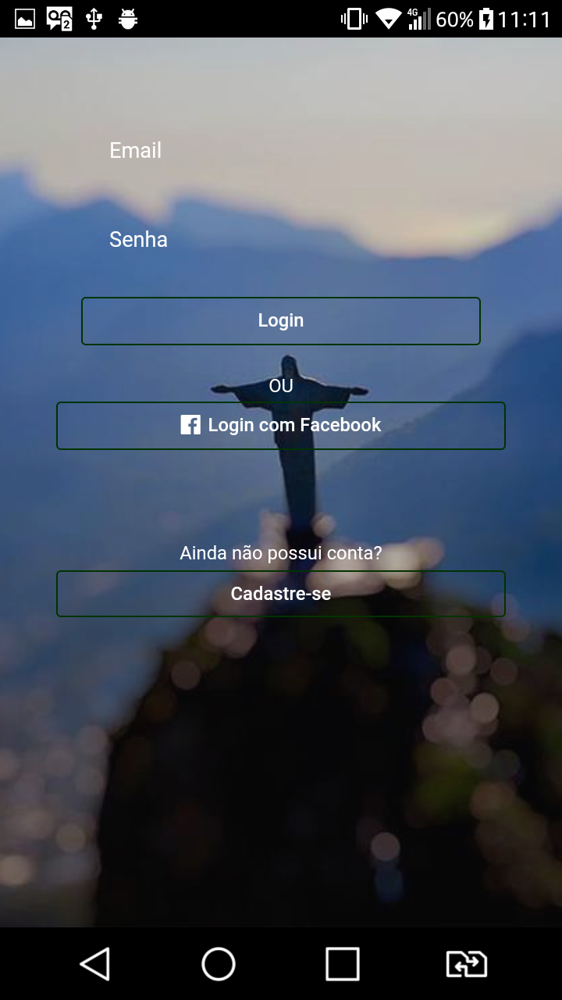
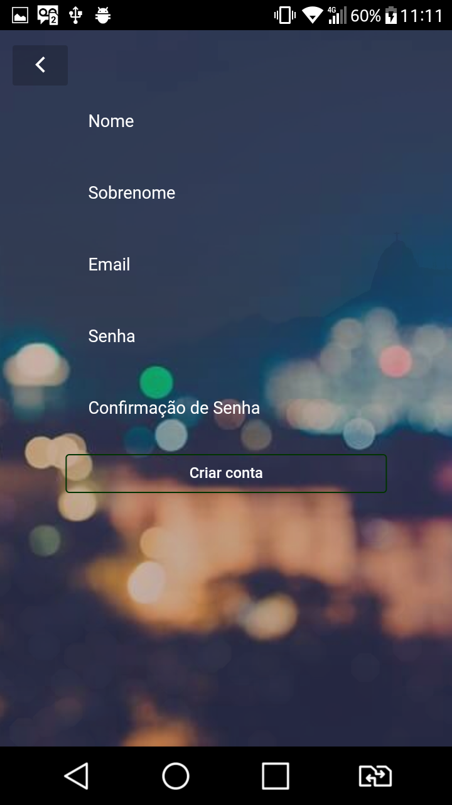
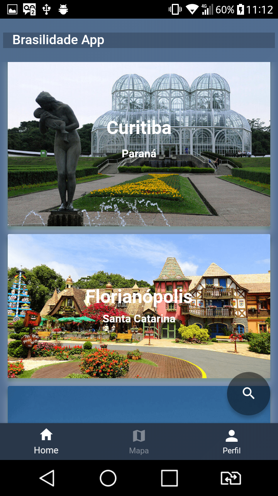

# Ionic Guia de Cidades / Ionic City Guide

## Obtenha o curso em [Udemy](https://www.udemy.com/ionic-3-app-guia-de-cidades/) / Get this cours in [Udemy](https://www.udemy.com/ionic-3-app-guia-de-cidades/)

## Recursos / Features

* Ionic Framework v3

* Conexão e recursos do Firebase / Firebase Connection and Features

* Login com Facebook / Login with Facebook

* Utilização do Google Maps / Using Google Maps

* Geolib

* Geolocation

* Estilização avançada do aplicativo / Advanced app styling

* Compartilhamento em Rede Social / Social Network Sharing

* Launch Navigator com Uber e Google Maps / Launch Navigator with Uber and Google Maps

* E muitos recursos.. / And many features..

## Telas / Screens: 

